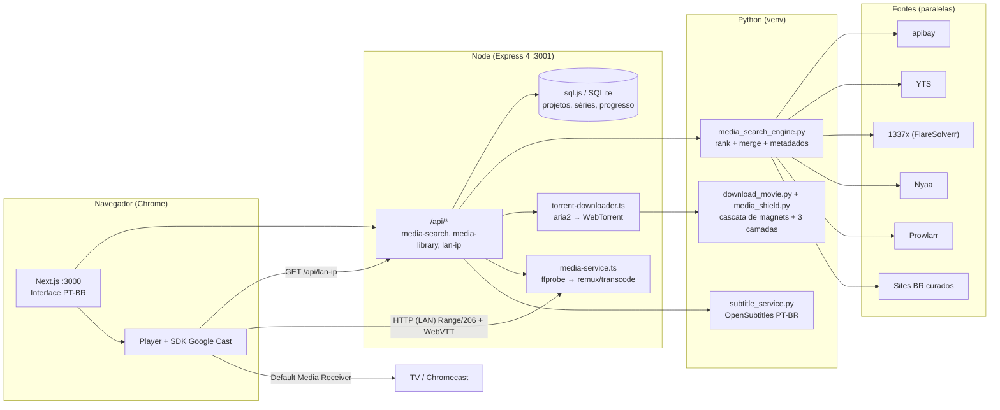

# JackIn

**Cinema P2P self-hosted — busque, baixe, assista e transmita para a TV.**

> JackIn é a parte "Flix" de um monorepo privado, extraída e publicada como projeto autônomo e open source.

  

---

## Índice

- [Sobre](#sobre)
- [✨ Funcionalidades](#-funcionalidades)
- [Arquitetura](#arquitetura)
- [Stack](#stack)
- [Estrutura do projeto](#estrutura-do-projeto)
- [Como rodar local](#como-rodar-local)
- [Docker](#docker)
- [API](#api)
- [Variáveis de ambiente](#variáveis-de-ambiente)
- [Google Cast](#google-cast)
- [Segurança & Aviso legal](#segurança--aviso-legal)
- [Roadmap](#roadmap)
- [Licença](#licença)
- [Agradecimentos](#agradecimentos)

---

## Sobre

O JackIn é um **cinema pessoal rodando na sua máquina**: ele busca torrents em múltiplos indexadores, baixa com segurança, organiza sua biblioteca de filmes e séries, reproduz em um player de cinema com faixas de áudio e legendas, e **transmite para a TV via Google Cast** — tudo self-hosted, gratuito e **sem login**.

Nada de conta, nada de nuvem, nada de assinatura: o JackIn não hospeda conteúdo — ele apenas **localiza e baixa o que você decidir buscar**, e a responsabilidade sobre o uso é exclusivamente sua (veja o [aviso legal](#segurança--aviso-legal)).

---

## ✨ Funcionalidades

### 🔍 Busca multi-fonte
- Consulta paralela em **The Pirate Bay (via apibay)**, **YTS**, **1337x (via FlareSolverr)**, **Nyaa**, **Prowlarr** e **sites brasileiros curados** (catálogos manuais de dublagens PT-BR).
- Interpretação de consultas por LLM (opcional): "aquela saga do anel" vira "O Senhor dos Anéis" (`/api/media-search/enhanced`).
- Preferência de áudio (dublado/dual), ranking por seeders, qualidade e disponibilidade PT-BR; opções organizadas em tiers (4K/1080p/720p).
- Enriquecimento de metadados via **TMDB** (pôster/backdrop/sinopse, com fallback para o iTunes) e merge com o catálogo da Wikipedia.

### 📥 Download seguro (Media Shield em 3 camadas)
1. **Whitelist/blacklist de extensões** — apenas contêineres de vídeo conhecidos; `.exe`, `.scr`, `.zip`, `.iso` etc. são bloqueados.
2. **Inspeção fail-closed via ffprobe** — o arquivo precisa ter vídeo + áudio (≥ estéreo) decodificáveis; qualquer falha de parse é rejeição.
3. **Quarentena em vez de deleção** — arquivo reprovado vai para `*.quarantine`, nunca some silenciosamente.
- **aria2 nativo** (download seletivo por índice, com cascata de magnets alternativos) com **fallback WebTorrent**; pausar, retomar e tentar novamente a partir da interface.
- Guarda contra path traversal em nomes de arquivo do torrent.

### 🎬 Player de cinema
- Faixas de áudio selecionáveis (dublado PT, original, etc.), legendas **WebVTT** e **remux/transcode via FFmpeg** sob demanda.
- Preparação automática por alvo: `master.mp4` (Safari) e `playable.mp4` (Chrome, H.264) com extração de legendas embutidas.
- Classificação inteligente do arquivo: `direct` (sem re-encode), `remux` ou `transcode` — só re-codifica quando necessário.

### 📺 Séries
- Importação de **temporada inteira a partir de UM magnet pack** (`--select-file` por episódio, casamento exato de `SxxExx`), com retomada idempotente.
- Agrupamento automático: todas as temporadas de uma série sob uma única entrada, com episódios organizados por temporada.

### 🗂️ Biblioteca com progresso
- Filmes e séries organizados em grade, com pôsteres, detalhes e **progresso de reprodução salvo** (retoma de onde parou, inclusive após transmitir para a TV).

### 📡 Google Cast para TV (grátis)
- Botão de transmitir no player usando o **Default Media Receiver** do Google — sem custo, sem app de receiver próprio.
- Detecção automática do **IP da LAN** (`/api/lan-ip`) e redirecionamento das URLs de mídia para a rede local.
- Legendas e áudio via **Cast tracks**; progresso sincronizado de volta para a biblioteca.

### 🇧🇷 Legendas PT-BR
- Busca automática no **OpenSubtitles** (hash oficial v3 do arquivo), convertida para WebVTT e servida pelo próprio servidor — também durante o Cast.

---

## Arquitetura

O JackIn é um monorepo npm com três aplicações: web (Next.js), API (Express) e engine de mídia (Python), mais infraestrutura opcional via Docker.



### Fluxos principais

**1. Busca** — o cliente chama a API do Next.js, que consulta o catálogo (Wikipedia) em paralelo com a engine Express `/api/media-search/enhanced`. A engine dispara o Python, que consulta **todas as fontes em paralelo** com isolamento de falha (uma fonte fora do ar nunca derruba as outras), merge por infohash, ranking e enriquecimento TMDB/iTunes. Timeout rígido de 180s e kill do processo se o cliente desconectar.

**2. Download** — `POST /api/media-search/download` cria o projeto no SQLite e dispara o worker Python: tenta magnets em **cascata** (aborta candidato lento após ~90s, limpa parciais e parte para o próximo), baixa com aria2 e passa pelo **Media Shield** antes de renomear para `original.<ext>`. Para séries, `import-season` baixa seletivamente cada episódio de um pack único.

**3. Preparação e streaming** — `prepareProject` sonda o arquivo com ffprobe, classifica (`direct`/`remux`/`transcode`), gera os artefatos por alvo (`master.mp4`, `playable.mp4`, legendas `subs_*.vtt`) e o player consome o vídeo via **Range requests (HTTP 206)**.

**4. Cast** — o player busca `/api/lan-ip`, reescreve a URL da mídia trocando `localhost` pelo IP da LAN e forçando `target=h264` (único codec do receiver padrão), anexa legendas WebVTT + faixa de áudio como **Cast tracks** e a TV baixa a mídia direto do servidor. O progresso volta ao servidor a cada ~3,5s.

---

## Stack

| Camada | Tecnologia | Papel |
|---|---|---|
| Frontend | **Next.js 16** (App Router) + **React 19** | Interface PT-BR, rotas de catálogo/API |
| UI | **Tailwind CSS v4** + **framer-motion** | Estilo e animações |
| API | **Express 4 + TypeScript** (tsx) | Servidor de mídia, biblioteca e busca |
| Banco | **sql.js** (SQLite via WASM) | Projetos, séries, episódios, progresso |
| Engine de mídia | **Python 3.11+** | Busca multi-fonte, download, shield, legendas |
| Torrent | **aria2** (primário) + **WebTorrent** (fallback) | Download de magnets com seleção de arquivo |
| Mídia | **FFmpeg / ffprobe** | Inspeção, remux, transcode, WebVTT |
| Agregação | **Prowlarr** (Docker, opcional) | Indexadores unificados via API |
| Anti-bot | **FlareSolverr** (Docker, opcional) | Bypass de Cloudflare no 1337x |
| Cast | **Google Cast SDK** (Default Media Receiver) | Transmissão para TV, gratuita |
| Metadados | **TMDB** (opcional) / **iTunes RSS** | Pôsteres, backdrops e sinopses |
| Legendas | **OpenSubtitles** (opcional) | Legendas PT-BR automáticas |

---

## Estrutura do projeto

```
JackIn/
├── apps/
│   ├── web/                        # Frontend — Next.js 16 (porta 3000)
│   │   └── src/
│   │       ├── app/                # Páginas: /, /filmes, /series, /search, /media
│   │       │   └── api/            # Rotas Next: /api (catálogo), /api/itunes
│   │       ├── components/
│   │       │   ├── layout/         # AppShell, Sidebar, Header
│   │       │   ├── media/          # CinemaPlayer, LibraryGrid, DownloadDock,
│   │       │   │                   # SearchResults*, TorrentOption*, modais...
│   │       │   └── ui/             # DeleteDialog
│   │       ├── hooks/              # useCast, useCatalog, useMediaExplorer...
│   │       ├── lib/                # cast.ts, wikipedia.ts, catalogSearch.ts
│   │       ├── types/              # media.ts, cast.d.ts
│   │       └── e2e/                # Playwright: search, catalog, download, cast
│   ├── server/                     # API — Express 4 + TS (porta 3001)
│   │   └── src/
│   │       ├── domains/media/      # media-search, media-search-llm,
│   │       │                       # torrent-downloader, trackers
│   │       └── services/           # media-service (prepare/transcode),
│   │                               # network (LAN IP), progress-events,
│   │                               # language-map, binary-paths
│   └── python-services/            # Engine Python (venv)
│       ├── core/                   # telemetry_utils
│       └── modules/media/          # media_search_engine, download_movie,
│                                   # media_shield, subtitle_service,
│                                   # sources*, matcher, normalize, query_expansion
├── data/                           # Runtime: SQLite + projetos (gitignored)
│   └── projects/<id>/              # original.*, master.mp4, playable.mp4, subs_*.vtt
├── dev.js                          # Launcher simultâneo dev:server + dev:web
├── docker-compose.yml              # Prowlarr + FlareSolverr (infra opcional)
├── .env.example                    # Modelo de configuração (sem segredos)
├── tsconfig.base.json
├── LICENSE                         # MIT
└── package.json                    # npm workspaces (apps/*)
```

---

## Como rodar local

### Pré-requisitos

| Dependência | Versão | Observação |
|---|---|---|
| Node.js | **20+** | Runtime da web e da API |
| Python | **3.11+** | Engine de busca/download (`requests` e `tqdm` no `requirements.txt`) |
| FFmpeg + ffprobe | recente | Remux/transcode e inspeção (`FFMPEG_BIN`/`FFPROBE_BIN` se não estiverem no PATH) |
| aria2 | recente | Download nativo de alta velocidade (opcional — sem ele, cai para WebTorrent) |
| Docker (opcional) | — | Prowlarr + FlareSolverr para indexadores e bypass de Cloudflare |

### Passo a passo

```bash
# 1. Instalar dependências (workspaces npm)
npm install

# 2. Configurar variáveis de ambiente
cp .env.example .env
#    → edite apenas o que for usar (tudo funciona vazio; veja a tabela abaixo)

# 3. Subir a API (porta 3001)
npm run dev:server

# 4. Em outro terminal, subir a web (porta 3000)
npm run dev:web
```

Ou, com um único comando (launcher `dev.js`, encerra ambos no Ctrl+C):

```bash
npm run dev:all
```

Abra **http://localhost:3000**. A primeira busca já funciona sem configuração adicional; indexadores extras (Prowlarr/FlareSolverr) e chaves de metadados/legendas são opcionais.

### Testes

```bash
# Frontend (Vitest)
npm test -w apps/web

# API (Vitest)
npm test -w apps/server

# Engine Python (unitários de busca)
python3 apps/python-services/modules/media/test_search_unit.py
```

Também há specs de E2E com Playwright em `apps/web/e2e/` (busca, catálogo, download e Cast).

---

## Docker

O `docker-compose.yml` sobe a **infraestrutura opcional** (indexadores e anti-bot). A web e a API rodam localmente via npm — o container só agrega fontes para o engine.

```bash
docker compose up -d
```

| Serviço | Imagem | Porta | Finalidade |
|---|---|---|---|
| `prowlarr` | `lscr.io/linuxserver/prowlarr:latest` | `9696` | Agregador de indexadores (defina `PROWLARR_URL`/`PROWLARR_API_KEY` no `.env`) |
| `flaresolverr` | `ghcr.io/flaresolverr/flaresolverr:latest` | `8191` | Resolve desafios Cloudflare (1337x); defina `FLARESOLVERR_URL` |

---

## API

Base: `http://localhost:3001/api` (configurável via `NEXT_PUBLIC_API_URL`). Todas as respostas seguem um envelope `{ success/error, data?, ... }` consistente. As rotas de busca podem levar dezenas de segundos (multi-fonte) e retornam opções de download por tier de qualidade.

### Busca e downloads — `/api/media-search`

| Rota | Método | Descrição |
|---|---|---|
| `/api/media-search/search` | GET | Busca multi-fonte (`q`, `audio=dub`, `ptTitle`, `year`, `posterUrl`, `overview`, `genre`). Timeout rígido de 180s |
| `/api/media-search/enhanced` | GET | Mesma busca com interpretação de consulta por LLM; degrada para `/search` sem chave |
| `/api/media-search/download` | POST | Cria o projeto e inicia o download (`title`, `sourceUrl`, `quality`, `posterUrl`, `seriesTitle`, `seasonNumber`, `episodeNumber`, `episodeTitle`) |
| `/api/media-search/retry/:projectId` | POST | Tenta novamente: re-download ou re-prepare (se o vídeo já existe em disco) |
| `/api/media-search/pause/:projectId` | POST | Pausa o download ativo (SIGSTOP no aria2 / pause no WebTorrent) |
| `/api/media-search/resume/:projectId` | POST | Retoma o download (SIGCONT / resume) |
| `/api/media-search/subtitles/:projectId` | POST | Busca legenda PT-BR no OpenSubtitles e grava `subs_ptbr.vtt` ao lado do vídeo |
| `/api/media-search/import-season` | POST | Importa temporada completa de UM magnet pack (`seriesTitle`, `seasonNumber`, `magnetUrl`, `episodes[]`); baixa seletivamente cada episódio |

### Biblioteca — `/api/media-library`

| Rota | Descrição |
|---|---|
| `/api/media-library/projects` | Lista/gerencia projetos (filmes e episódios) |
| `/api/media-library/series` | Série agrupada com temporadas e episódios (um `seriesId` por título) |
| `/api/media-library/history` | Histórico de reprodução |
| `/api/media-library/progress` | Salva/consulta progresso de reprodução |
| `/api/media-library/watched` | Marca/consulta itens assistidos |

### Reprodução — `/api/projects/:id`

| Rota | Método | Descrição |
|---|---|---|
| `/api/projects/:id/video` | GET | Stream de vídeo com **suporte a Range (206)**; parâmetros `target=h264\|hevc` e `audio=<lang>` |
| `/api/projects/:id/tracks` | GET | Faixas de áudio disponíveis (player local e Cast) |
| `/api/projects/:id/cast` | GET | Resolução do arquivo compatível com Cast (H.264 + áudio seguro: aac/mp3/ac3/eac3) |
| `/api/projects/:id/subtitles` | GET | Legenda WebVTT (`?lang=pt-br` etc.) — usada pelo player e pelo Cast |
| `/api/projects/:id/thumbnail` | GET | Pôster/miniatura do projeto |

### Rede

| Rota | Método | Descrição |
|---|---|---|
| `/api/lan-ip` | GET | IP da LAN (prioriza `192.168.x` > `10.x` > `172.16-31.x`) + porta — usado pelo Google Cast |

---

## Variáveis de ambiente

Todas as variáveis são definidas no [`.env.example`](.env.example) — **nenhum valor secreto está versionado**. Tudo é opcional: sem chave alguma, o JackIn ainda busca nas fontes públicas e usa artwork do iTunes.

| Variável | Obrigatória? | Descrição |
|---|---|---|
| `NEXT_PUBLIC_API_URL` | Não | URL base da API consumida pela web (default `http://localhost:3001/api`) |
| `TMDB_API_KEY` | Não | Metadados (pôsteres/backdrops); sem ela, fallback para o iTunes |
| `ZEN_API_KEY` | Não | Interpretação de consultas por LLM em `/enhanced` (degrade silencioso) |
| `OPENSUBTITLES_API_KEY` | Não | Legendas PT-BR automáticas (OpenSubtitles) |
| `OPENSUBTITLES_USERNAME` | Não | Login OpenSubtitles |
| `OPENSUBTITLES_PASSWORD` | Não | Senha OpenSubtitles |
| `PROWLARR_URL` | Não | URL do Prowlarr (default `http://localhost:9696`) |
| `PROWLARR_API_KEY` | Não | Chave de API do Prowlarr |
| `FLARESOLVERR_URL` | Não | URL do FlareSolverr (ativado para o 1337x) |
| `ENABLE_1337X` / `ENABLE_NYAA` / `ENABLE_PROWLARR` | Não | Liga/desliga scrapers (1/0) |
| `FFMPEG_BIN` / `FFPROBE_BIN` / `ARIA2_BIN` | Não | Caminho dos binários (vazio = auto-detect via PATH) |
| `P2P_TRACKERS` | Não | Trackers customizados (vazio = lista interna de fallback) |
| `P2P_INSECURE_SSL` | Não | `1` desativa verificação SSL dos scrapers (usar com cautela) |
| `JACKIN_FAST_TRANSCODE` | Não | `1` = transcode via VideoToolbox no macOS (mais rápido, qualidade menor) |
| `E2E_LAN_IP` | Não | IP da LAN para testes e2e de Cast |

---

## Google Cast

Transmitir para a TV é **gratuito** e usa o **Default Media Receiver** do Google — nenhuma configuração de receiver é necessária.

1. Abra o JackIn no **Chrome** em `http://localhost:3000` (o SDK do sender é Chrome e exige contexto seguro; `localhost` conta como seguro).
2. Reproduza um item e clique no botão de transmitir no player.
3. O player consulta `GET /api/lan-ip`, reescreve a URL da mídia com o **IP da LAN** (a TV baixa direto do servidor) e força `target=h264`.
4. Legendas WebVTT e a faixa de áudio selecionada são anexadas como **Cast tracks**.
5. O progresso é sincronizado de volta à biblioteca a cada ~3,5s — retome na TV ou no navegador de onde parou.

### Requisitos e limitações

- **Chrome** (desktop ou Android) — o SDK do sender não roda em Safari/Firefox.
- O servidor precisa estar **acessível na LAN** na porta **3001** (liberar no firewall do macOS/roteador se necessário).
- A TV recebe **H.264** (único codec garantido pelo receiver padrão) — o servidor entrega `playable.mp4` ou transcode quando preciso.
- Não há suporte nativo a **Fire Stick / Fire TV** (que não usam o receiver padrão do Google).
- Se a TV não aparecer, confirme que os dois dispositivos estão na mesma rede e que `http://<ip-da-lan>:3001/api/lan-ip` responde.

---

## Segurança & Aviso legal

> **IMPORTANTE — leia antes de usar.**

O JackIn **não hospeda, não distribui e não produz nenhum conteúdo protegido por direitos autorais**. Ele apenas **localiza** torrents em indexadores públicos e **baixa aquilo que o usuário explicitamente escolher buscar**, por decisão e responsabilidade exclusivas do usuário.

- **Uso:** educacional e pessoal. Antes de baixar qualquer obra, verifique se você tem o direito de fazê-lo no seu país.
- **Responsabilidade:** é do usuário respeitar a legislação local de copyright. O autor não se responsabiliza pelo uso indevido do software.
- **Ferramentas de terceiros:** o JackIn integra indexadores (Pirate Bay, YTS, 1337x, Nyaa, Prowlarr) e serviços (TMDB, OpenSubtitles, Google Cast) operados por terceiros, sujeitos aos próprios termos e disponibilidade.
- **Sem garantias:** o software é distribuído **no estado em que se encontra** (licença MIT), sem garantias de qualquer tipo, expressas ou implícitas.

---

## Roadmap

### 🎉 Watch party sincronizada *(planejada — não implementada)*
Assistir juntos à distância, com reprodução sincronizada entre participantes:

- **Máquina de estados inspirada no SyncPlay** (Jellyfin) — transições controladas de play/pause/seek com reconciliação de drift.
- **Âncora de tempo compartilhada** — um relógio comum (e.g. tempo absoluto de mídia + offset de sessão) para todos os membros da sala.
- **Código de 6 dígitos** — entrar em uma sala digitando um código curto, sem contas.

### 🔧 Endurecimento
- Busca e streaming: mais isolamento de fontes, retries com backoff e filtros de qualidade ainda mais rígidos.
- Cache multi-tier (metadados, resultados de busca, probes) para reduzir latência e batidas em APIs externas.

---

## Licença

Distribuído sob a **licença MIT** — © 2026 Fernando Sonaglio. Veja o arquivo [LICENSE](LICENSE) para os termos completos.

---

## Agradecimentos

O JackIn não reinventa a roda: ele **assimila padrões** de projetos excepcionais da comunidade. Obrigado a:

- **Jellyfin** — pela máquina de estados do SyncPlay que inspira a watch party do roadmap;
- **Stremio** — pela experiência de catálogo + addons que orienta o fluxo de busca;
- **WebTorrent** — o fallback de download em JavaScript que mantém o JackIn funcional sem aria2;
- **FlareSolverr** — o bypass de Cloudflare que mantém o 1337x acessível;
- **Prowlarr** — o agregador de indexadores self-hosted;
- **1337x, The Pirate Bay e YTS** — as fontes públicas que alimentam as buscas;
- **TMDB** — pelos metadados que dão cara de cinema à biblioteca;
- **OpenSubtitles** — pelas legendas PT-BR automáticas.
