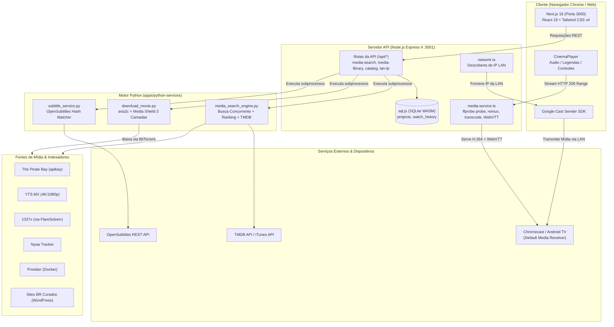

# JackIn

**Cinema P2P self-hosted — busque, baixe, assista e transmita para a sua TV.**

> JackIn é um ecossistema completo de streaming pessoal e cinema P2P autônomo, open source e 100% self-hosted.

     

---

## 📑 Índice

- [Sobre o Projeto](#-sobre-o-projeto)
- [✨ Principais Funcionalidades](#-principais-funcionalidades)
- [🏗️ Arquitetura do Sistema](#️-arquitetura-do-sistema)
- [💻 Stack Tecnológica](#-stack-tecnológica)
- [📂 Estrutura do Monorepo](#-estrutura-do-monorepo)
- [🚀 Como Executar Localmente](#-como-executar-localmente)
- [🐳 Infraestrutura Docker (Opcional)](#-infraestrutura-docker-opcional)
- [🔌 Referência Completa da API](#-referência-completa-da-api)
- [⚙️ Variáveis de Ambiente](#️-variáveis-de-ambiente)
- [📺 Google Cast (Transmissão para TV)](#-google-cast-transmissão-para-tv)
- [🛡️ Segurança, Media Shield & Aviso Legal](#️-segurança-media-shield--aviso-legal)
- [🗺️ Roadmap](#️-roadmap)
- [📄 Licença](#-licença)
- [💙 Agradecimentos](#-agradecimentos)

---

## 🎬 Sobre o Projeto

O **JackIn** transforma seu computador em um servidor de streaming pessoal de alta performance. Ele agrega múltiplos indexadores de mídia pública, realiza downloads seguros com validação de integridade por antivírus/ffprobe, cataloga seus filmes e séries, extrai legendas e faixas de áudio, e entrega uma experiência cinematográfica fluida no navegador ou direto na sua TV via Google Cast.

* **100% Sem Login e Sem Nuvem:** Nada de contas, dados na nuvem ou assinaturas.
* **Self-Hosted:** Seus arquivos, metadados e histórico permanecem exclusivamente no seu armazenamento local.
* **Pronto para Uso:** Funciona imediatamente sem exigir chaves de API pagas ou configurações complexas.

---

## ✨ Principais Funcionalidades

### 🔍 1. Busca Multi-Fonte Inteligente & Paralela
* **Consulta Paralela com Isolamento de Falhas:** Varredura concorrente em **The Pirate Bay (apibay)**, **YTS**, **1337x (via FlareSolverr)**, **Nyaa**, **Prowlarr** e **sites brasileiros curados** (como *BaixeTorrents*, *MestreDosFilmes* e *LimonTorrents*).
* **Classificação e Priorização de Áudio:** Reconhecimento automático de releases **Dublado PT-BR**, **Dual Áudio**, **Legendado PT-BR** e **Áudio Original**.
* **Interpretação e Expansão de Consultas:** Normalização de títulos compostos (ex.: *"O Senhor dos Anéis: A Sociedade do Anel"* ↔ *"The Lord of the Rings: The Fellowship of the Ring"*), tratamento de franquias e remoção de termos ruído.
* **Tiers de Qualidade e Ordenação:** Classificação de opções por resolução e fonte (**4K Ultra HD**, **1080p Full HD**, **720p HD**, **Outros**) com pontuação baseada em seeders reais e integridade.
* **Metadados em Alta Definição:** Enriquecimento com pôsteres, backdrops, sinopses, notas e gêneros via **TMDB API** (com fallback automático para a **iTunes Store Search API**).

### 📚 2. Catálogo Paginado (Filmes & Séries)
* **Páginas Dedicadas:** Navegação fluida em `/filmes` e `/series` com **18 títulos por página**.
* **Filtros Avançados por Gênero:** Ação, Ficção Científica, Animação, Comédia, Terror, Romance, Drama, Suspense, Documentário e muito mais.
* **Paginação com Salto Direto:** Interface de paginação janelada com acesso direto a qualquer página, sincronizada via query parameters na URL (`?page=2&genre=scifi`).
* **Carregamento Otimizado:** Pré-carregamento dinâmico de pôsteres e dados em cache no servidor para transições de página instantâneas.

### 🛡️ 3. Media Shield & Download Resiliente (3 Camadas)
* **Camada 1 — Filtragem Estrita de Extensões:** Whitelist de contêineres de vídeo válidos (`.mp4`, `.mkv`, `.webm`, `.mov`, `.avi`, `.m4v`, `.ts`, `.m2ts`) e bloqueio ativo de arquivos executáveis ou perigosos (`.exe`, `.scr`, `.bat`, `.vbs`, `.zip`, `.iso`, etc.).
* **Camada 2 — Sondagem Fail-Closed com FFprobe:** O download só é aprovado se o contêiner tiver fluxos decodificáveis reais de vídeo e áudio (estéreo ou multicanal 5.1/7.1). Arquivos sem áudio ou corrompidos são rejeitados.
* **Camada 3 — Quarentena Segura:** Arquivos reprovados são isolados em arquivos `*.quarantine` para diagnóstico, prevenindo perda de dados ou deleção acidental.
* **Motor BitTorrent P2P com aria2:** Download multithread de alta performance com DHT/PEX e lista de trackers públicos.
* **Cascata Inteligente de Fallback:** Se o magnet principal estiver inativo (0 seeders), o sistema tenta automaticamente os magnets alternativos coletados na busca.
* **Auto-Retry & Controles:** Retentativas automáticas com backoff exponencial para falhas transitórias, além de suporte nativo para **Pausar**, **Retomar** e **Tentar Novamente**.

### 🎬 4. Player de Cinema Avançado (CinemaPlayer)
* **Reprodução Imersiva:** Player moderno construído em React 19 e framer-motion com tema escuro cinematográfico.
* **Seleção de Faixas de Áudio & Legendas:** Alternância dinâmica entre múltiplos canais de áudio e legendas WebVTT extraídas ou baixadas.
* **Streaming sob Demanda (HTTP 206 Range):** Reprodução instantânea com suporte a busca rápida na linha do tempo.
* **Motor de Preparação de Mídia (`media-service.ts`):**
  * `direct`: Transmissão direta sem overhead para arquivos compatíveis.
  * `remux`: Reempacotamento ultra-rápido de contêiner sem recodificação de vídeo.
  * `transcode`: Conversão sob demanda com suporte a aceleração por hardware (VideoToolbox no macOS).
  * **Compensação HE-AAC:** Correção de priming delay para prevenir dessincronia de áudio e vídeo em navegadores.
* **Atalhos de Teclado Completos:** Espaço (Play/Pause), Setas (Seek e Volume), `F` (Tela Cheia), `M` (Mudo), `J`/`L` (±10s).
* **Legendas Automáticas OpenSubtitles:** Download sob demanda de legendas em português do Brasil sincronizadas via hash de arquivo.

### 📺 5. Séries & Packs de Temporadas
* **Importação de Temporada Completa:** Download seletivo de episódios individuais a partir de um único magnet pack de temporada (`--select-file`).
* **Agrupamento Automático:** Unificação de todas as temporadas e episódios sob uma única entidade de série (`series_id`).
* **Preparo Individual:** Processamento independente de episódios para que fiquem imediatamente prontos para reprodução.

### 🗄️ 6. Biblioteca Pessoal & Histórico
* **Grade da Biblioteca:** Gerenciamento de itens baixados, em andamento, pausados ou concluídos.
* **Sincronização de Progresso:** Posição salva automaticamente em tempo real para retomar de onde parou em qualquer dispositivo.
* **Histórico Detalhado:** Registro de itens assistidos com filtros, data e opção de limpeza.

### 📡 7. Google Cast Integrado (Transmissão para TV)
* **100% Gratuito:** Utiliza o *Google Default Media Receiver* — sem necessidade de conta de desenvolvedor do Google Cast ou app de receiver pago.
* **Descoberta Automática de IP da LAN:** Roteamento automático da mídia substituindo `localhost` pelo IP local do servidor (`/api/lan-ip`).
* **Trilhas de Áudio e Legendas na TV:** Transmissão de legendas WebVTT e seleção de áudio via Cast tracks.
* **Sincronização Bidirecional:** O progresso assistido na TV é sincronizado de volta para a biblioteca do computador.

---

## 🏗️ Arquitetura do Sistema



---

## 💻 Stack Tecnológica

| Camada | Tecnologia | Propósito |
|---|---|---|
| **Frontend** | **Next.js 16 (App Router)** + **React 19** | Interface web responsiva, renderização otimizada e rotas de catálogo |
| **Estilização** | **Tailwind CSS v4** + **framer-motion** | Design system moderno com micro-interações fluidas |
| **Backend API** | **Express 4** + **TypeScript (tsx)** | Servidor de API REST, gerenciamento de projetos e streaming de mídia |
| **Banco de Dados** | **sql.js (SQLite)** | Armazenamento local persistido em arquivo (`data/jackin.db`) |
| **Engine de Mídia** | **Python 3.11+** | Scraping concorrente, expansão de consultas, Media Shield e automação |
| **Downloader P2P** | **aria2** (nativo) + **WebTorrent** (fallback) | Download BitTorrent de alta velocidade com suporte a seleção de arquivos |
| **Processamento Audiovisual** | **FFmpeg** & **FFprobe** | Inspeção técnica de faixas, remuxing em tempo real, transcodificação e legendas |
| **Agregação de Torrents** | **Prowlarr** (Opcional via Docker) | Unificação e gestão de indexadores adicionais |
| **Bypass Anti-Bot** | **FlareSolverr** (Opcional via Docker) | Resolução de desafios Cloudflare em fontes protegidas |
| **Transmissão para TV** | **Google Cast SDK** | Streaming direto para Smart TVs e Chromecasts |
| **Metadados & Legendas** | **TMDB API**, **iTunes API**, **OpenSubtitles** | Pôsteres, sinopses e legendas sincronizadas em português |

---

## 📂 Estrutura do Monorepo

```
JackIn/
├── apps/
│   ├── web/                              # Frontend Next.js 16
│   │   ├── src/
│   │   │   ├── app/                      # Páginas: /, /filmes, /series, /search, /biblioteca
│   │   │   │   └── api/                  # Rotas Next.js (catálogo, itunes)
│   │   │   ├── components/               # Componentes modulares
│   │   │   │   ├── layout/               # Header, Sidebar, AppShell
│   │   │   │   ├── media/                # CinemaPlayer, MediaCard, SearchBar, DownloadDock, modais...
│   │   │   │   └── ui/                   # Modais de confirmação, botões, diálogos
│   │   │   ├── hooks/                    # useCast, useCatalog, useMediaExplorer...
│   │   │   ├── lib/                      # cast.ts, api.ts, catalogSearch.ts...
│   │   │   └── types/                    # media.ts, cast.d.ts...
│   │   └── e2e/                          # Testes E2E com Playwright
│   ├── server/                           # Backend Express + TypeScript
│   │   └── src/
│   │       ├── db/                       # Inicialização e persistência do SQLite (sql.js)
│   │       ├── domains/
│   │       │   ├── library/              # Gerenciamento de biblioteca, catálogo e histórico
│   │       │   └── media/                # Busca de mídia, downloader e agendamento de retries
│   │       └── services/                 # media-service (FFmpeg), network (LAN IP), progress-events
│   └── python-services/                  # Motor de busca e download em Python
│       └── modules/media/                # media_search_engine, download_movie, media_shield,
│                                         # sources_*, normalize, matcher, subtitle_service...
├── data/                                 # Diretório de execução (SQLite + arquivos baixados)
│   ├── jackin.db                         # Banco de dados local SQLite
│   └── projects/<id>/                    # Arquivos master.mp4, playable.mp4, subs_*.vtt, thumbnail.jpg
├── dev.js                                # Script de inicialização simultânea dos serviços
├── docker-compose.yml                    # Configuração de serviços de apoio (Prowlarr, FlareSolverr)
├── .env.example                          # Modelo de variáveis de ambiente
├── tsconfig.base.json                    # Configuração base de TypeScript
├── package.json                          # Configuração do monorepo npm workspaces
└── LICENSE                               # Licença MIT
```

---

## 🚀 Como Executar Localmente

### 📋 Pré-requisitos

| Ferramenta | Versão Mínima | Finalidade |
|---|---|---|
| **Node.js** | **20.x ou superior** | Execução do frontend web e servidor Express |
| **Python** | **3.11 ou superior** | Execução do motor de busca e validação de mídia |
| **FFmpeg & FFprobe** | Versão recente | Inspeção de arquivos, remux e transcodificação |
| **aria2** | Versão recente (`aria2c`) | Downloader BitTorrent de alta velocidade |
| **Docker** *(Opcional)* | Versão recente | Execução do Prowlarr e FlareSolverr |

> 💡 **Dica (macOS via Homebrew):** `brew install node python ffmpeg aria2`  
> 💡 **Dica (Ubuntu/Debian via apt):** `sudo apt update && sudo apt install -y nodejs npm python3 python3-venv ffmpeg aria2`

---

### 🛠️ Instalação Passo a Passo

```bash
# 1. Clone o repositório
git clone https://github.com/fersonaglio/JackIn.git
cd JackIn

# 2. Instale as dependências do monorepo
npm install

# 3. Configure o ambiente virtual Python
python3 -m venv .venv
.venv/bin/pip install -r apps/python-services/requirements.txt

# 4. Crie o arquivo de ambiente a partir do modelo
cp .env.example .env
# (Opcional) Adicione sua TMDB_API_KEY no .env para pôsteres e metadados completos
```

---

### ▶️ Iniciando o Projeto

Para rodar todo o ecossistema com um único comando (frontend + backend sincronizados com encerramento automático em `Ctrl+C`):

```bash
npm run dev:all
```

Ou execute individualmente em terminais separados:

```bash
# Terminal 1 — Servidor API (Porta 3001)
npm run dev:server

# Terminal 2 — Frontend Web (Porta 3000)
npm run dev:web
```

Acesse **[http://localhost:3000](http://localhost:3000)** no seu navegador.

---

### 🧪 Executando Testes

```bash
# Testes unitários do Frontend (Vitest)
npm test -w apps/web

# Testes unitários do Servidor API (Vitest)
npm test -w apps/server

# Testes unitários do Motor de Busca Python
python3 apps/python-services/modules/media/test_search_unit.py

# Testes de Ponta a Ponta E2E (Playwright)
npx playwright test -c apps/web/playwright.config.ts
```

---

## 🐳 Infraestrutura Docker (Opcional)

Para expandir o alcance das buscas com indexadores adicionais e bypass automatizado de proteções Cloudflare:

```bash
docker compose up -d
```

| Serviço | Porta | Descrição |
|---|---|---|
| **Prowlarr** | `9696` | Agregador de indexadores de torrents (configure `PROWLARR_URL` e `PROWLARR_API_KEY` no `.env`) |
| **FlareSolverr** | `8191` | Serviço proxy para resolução de desafios Cloudflare em sites como o 1337x (`FLARESOLVERR_URL`) |

---

## 🔌 Referência Completa da API

A API HTTP do JackIn opera por padrão em `http://localhost:3001/api`.

### 🔍 Busca & Downloads — `/api/media-search`

| Método | Endpoint | Descrição | Parâmetros / Body |
|---|---|---|---|
| `GET` | `/api/media-search/search` | Busca paralela multi-fonte | `q`, `audio` (`dub`, `dual`, `ptbr`, `original`, `any`), `year`, `genre` |
| `GET` | `/api/media-search/enhanced` | Busca enriquecida com normalização TMDB | `q`, `audio`, `year`, `genre` |
| `POST` | `/api/media-search/download` | Inicia o download de um filme ou episódio | `{ title, quality, sourceUrl, posterUrl, altSourceUrls, requirePt, seriesTitle, seasonNumber, episodeNumber }` |
| `POST` | `/api/media-search/retry/:projectId` | Força a retentativa de download/preparo | ID do projeto |
| `POST` | `/api/media-search/pause/:projectId` | Pausa o download ativo | ID do projeto |
| `POST` | `/api/media-search/resume/:projectId` | Retoma o download pausado | ID do projeto |
| `POST` | `/api/media-search/subtitles/:projectId` | Busca legendas PT-BR no OpenSubtitles | ID do projeto |
| `POST` | `/api/media-search/import-season` | Importa temporada completa via pack | `{ seriesTitle, seasonNumber, magnetUrl, episodes: [...] }` |

---

### 📚 Biblioteca & Histórico — `/api/media-library` e `/api/projects`

| Método | Endpoint | Descrição | Parâmetros / Body |
|---|---|---|---|
| `GET` | `/api/projects` | Lista todos os projetos da biblioteca | `?type=movie` ou `?type=series` |
| `GET` | `/api/projects/:id` | Retorna os detalhes de um projeto específico | ID do projeto |
| `DELETE` | `/api/projects/:id` | Remove o projeto e exclui arquivos do disco | `?deleteFiles=true` |
| `GET` | `/api/projects/series/:seriesId` | Retorna episódios agrupados de uma série | ID da série |
| `DELETE` | `/api/projects/series/:seriesId` | Exclui todos os episódios de uma série | `?deleteFiles=true` |
| `GET` | `/api/projects/history/all` | Retorna o histórico de reprodução | — |
| `DELETE` | `/api/projects/history/:id` | Remove um item do histórico | ID do item |
| `GET` | `/api/projects/:id/progress` | Consulta o progresso salvo (tempo em segundos) | ID do projeto |
| `PUT` | `/api/projects/:id/progress` | Salva o progresso de reprodução | `{ position: number }` |
| `PUT` | `/api/projects/:id/watched` | Marca/desmarca projeto como assistido | `{ watched: boolean }` |

---

### 🎥 Streaming & Mídia — `/api/projects/:id/*`

| Método | Endpoint | Descrição |
|---|---|---|
| `GET` | `/api/projects/:id/video` | Stream de vídeo com suporte a **HTTP 206 Partial Content (Range)**. Suporta `?target=h264` e `?audio=<lang>` |
| `GET` | `/api/projects/:id/tracks` | Lista faixas de áudio e legendas disponíveis no arquivo |
| `GET` | `/api/projects/:id/subtitles` | Serve arquivo de legendas WebVTT (`?lang=pt-br`, `?lang=en`) |
| `GET` | `/api/projects/:id/thumbnail` | Serve o pôster ou thumbnail do item |
| `GET` | `/api/projects/:id/cast` | Valida e resolve o arquivo de mídia compatível para Google Cast |

---

### 🌐 Catálogo & Sistema — `/api/catalog` e `/api/lan-ip`

| Método | Endpoint | Descrição |
|---|---|---|
| `GET` | `/api/catalog/discover` | Catálogo paginável TMDB Discover (`?type=movie\|tv&genre=<key>&page=<num>`) |
| `GET` | `/api/lan-ip` | Retorna o endereço IP principal da LAN e porta do servidor para o Google Cast |
| `GET` | `/api/health` | Verificação de integridade do servidor |

---

## ⚙️ Variáveis de Ambiente

As configurações são definidas no arquivo `.env`. Veja a referência completa:

| Variável | Padrão | Descrição |
|---|---|---|
| `NEXT_PUBLIC_API_URL` | `http://localhost:3001/api` | URL base da API consumida pelo frontend |
| `PORT` | `3001` | Porta de escuta do servidor Express |
| `TMDB_API_KEY` | *Vazio* | Chave da API do TMDB para metadados e pôsteres em alta definição *(Recomendado)* |
| `OPENSUBTITLES_API_KEY` | *Vazio* | Chave da API do OpenSubtitles para busca automatizada de legendas |
| `OPENSUBTITLES_USERNAME` | *Vazio* | Usuário da conta OpenSubtitles |
| `OPENSUBTITLES_PASSWORD` | *Vazio* | Senha da conta OpenSubtitles |
| `PROWLARR_URL` | `http://localhost:9696` | Endereço do servidor Prowlarr |
| `PROWLARR_API_KEY` | *Vazio* | Chave de API do Prowlarr |
| `FLARESOLVERR_URL` | *Vazio* | Endereço do FlareSolverr para resolução de Cloudflare (ex: `http://localhost:8191/v1`) |
| `ENABLE_1337X` | `1` | Habilita/desabilita o scraper do 1337x (`1` ou `0`) |
| `ENABLE_NYAA` | `1` | Habilita/desabilita o scraper do Nyaa (`1` ou `0`) |
| `ENABLE_PROWLARR` | `1` | Habilita/desabilita a consulta ao Prowlarr (`1` ou `0`) |
| `FFMPEG_BIN` | *Auto-detect* | Caminho customizado para o executável `ffmpeg` |
| `FFPROBE_BIN` | *Auto-detect* | Caminho customizado para o executável `ffprobe` |
| `ARIA2_BIN` | *Auto-detect* | Caminho customizado para o executável `aria2c` |
| `PYTHON_BIN` | *Auto-detect* | Caminho customizado para o interpretador Python da venv |
| `JACKIN_FAST_TRANSCODE` | *Vazio* | `1` para ativar aceleração por hardware VideoToolbox no macOS |
| `P2P_INSECURE_SSL` | `0` | `1` para ignorar verificação de certificado SSL em scrapers de torrent |

---

## 📺 Google Cast (Transmissão para TV)

O JackIn oferece transmissão nativa para televisores com suporte a Google Cast (Chromecast, Android TV, Google TV) de forma **100% gratuita**:

1. Abra o JackIn em um navegador baseado em Chromium (como **Google Chrome** ou **Brave**) acessando `http://localhost:3000`.
2. Inicie a reprodução de qualquer filme ou série no **CinemaPlayer**.
3. Clique no ícone de **Transmitir (Google Cast)** na barra de controles do player.
4. O player consulta automaticamente `/api/lan-ip`, obtém o IP da máquina na rede local e entrega a mídia em H.264 compatível com o Chromecast.
5. Selecione faixas de áudio e ative legendas WebVTT diretamente na TV.
6. O progresso é salvo continuamente no servidor — ao pausar na TV, você pode retomar no computador exatamente de onde parou.

> 📌 **Nota:** Para o Cast funcionar, o computador servidor e a TV devem estar conectados à **mesma rede local (Wi-Fi/Ethernet)** e a porta `3001` deve estar liberada no firewall do sistema operacional.

---

## 🛡️ Segurança, Media Shield & Aviso Legal

### 🔒 Media Shield
O JackIn implementa um escudo de segurança em três camadas para proteger o usuário de arquivos nocivos na rede BitTorrent:
1. **Rejeição Preventiva:** Bloqueio imediato de extensões executáveis (`.exe`, `.bat`, `.cmd`, `.scr`, `.ps1`, `.msi`, `.jar`, `.iso`, etc.).
2. **Inspeção de Mídia:** Validação estrita de fluxos decodificáveis com FFprobe antes de liberar qualquer arquivo para a biblioteca.
3. **Quarentena Não-Destrutiva:** Arquivos inválidos são isolados em quarentena para inspeção e nunca são executados pelo sistema.

---

### ⚠️ Aviso Legal & Termos de Uso

> **IMPORTANTE: Leia atentamente antes de utilizar o software.**

* O JackIn **não hospeda, não armazena em servidores próprios e não distribui qualquer conteúdo protegido por direitos autorais**.
* O software atua exclusivamente como uma ferramenta de indexação técnica e agregação de dados públicos da rede BitTorrent P2P.
* O download e a transmissão de qualquer obra audiovisual são de **responsabilidade exclusiva do usuário**. Verifique a legislação de direitos autorais aplicável no seu país antes de realizar o download de qualquer material.
* O projeto destina-se a fins de **estudo, pesquisa, desenvolvimento tecnológico e uso pessoal**.
* O software é fornecido sob os termos da **Licença MIT**, *"no estado em que se encontra"* (*AS IS*), sem garantias expressas ou implícitas quanto a funcionamento, disponibilidade de fontes de terceiros ou adequação a finalidades específicas.

---

## 🗺️ Roadmap

- [x] **Busca Multi-Fonte Paralela** (TPB, YTS, 1337x, Nyaa, Prowlarr, Sites BR)
- [x] **Media Shield em 3 Camadas** com inspeção e quarentena
- [x] **CinemaPlayer Completo** com suporte a áudio multicanal e legendas WebVTT
- [x] **Google Cast Integrado** com descoberta de IP LAN e Cast tracks
- [x] **Catálogo Paginado com Filtros por Gênero** (TMDB Discover)
- [x] **Gerenciamento de Séries e Packs de Temporadas**
- [x] **Histórico de Reprodução e Retomada de Posição**
- [ ] **Watch Party Sincronizada (SyncPlay):** Salas com código de 6 dígitos para reprodução sincronizada entre múltiplos usuários sem necessidade de login.
- [ ] **Cache Multi-Tier Distribuído:** Otimização adicional de latência para metadados e probes de mídia pesados.
- [ ] **Integração com RealDebrid / Debrid-Link:** Suporte opcional a provedores de debrid para streaming direto sem semeadura P2P.

---

## 📄 Licença

Distribuído sob a licença **MIT**. Consulte o arquivo [LICENSE](LICENSE) para mais detalhes.

Copyright © 2026 **Fernando Sonaglio**.

---

## 💙 Agradecimentos

O JackIn se apoia nos padrões e inovações de projetos notáveis da comunidade open source:

* **[FFmpeg](https://ffmpeg.org/)** — Pelo motor audiovisual que torna o streaming e a transcodificação possíveis.
* **[aria2](https://aria2.github.io/)** — Pelo utilitário de download leve, rápido e multithread.
* **[Jellyfin](https://jellyfin.org/)** — Pela inspiração em arquitetura de mídia self-hosted.
* **[Stremio](https://www.stremio.com/)** — Pelos conceitos de agregação e catálogo modular.
* **[FlareSolverr](https://github.com/FlareSolverr/FlareSolverr)** — Pelo bypass automatizado de proteções Cloudflare.
* **[Prowlarr](https://prowlarr.com/)** — Pela gestão simplificada de indexadores torrent.
* **[The Movie Database (TMDB)](https://www.themoviedb.org/)** — Pela base de metadados e pôsteres de alta qualidade.
* **[OpenSubtitles](https://www.opensubtitles.com/)** — Pela disponibilização de legendas sincronizadas para o público brasileiro.
